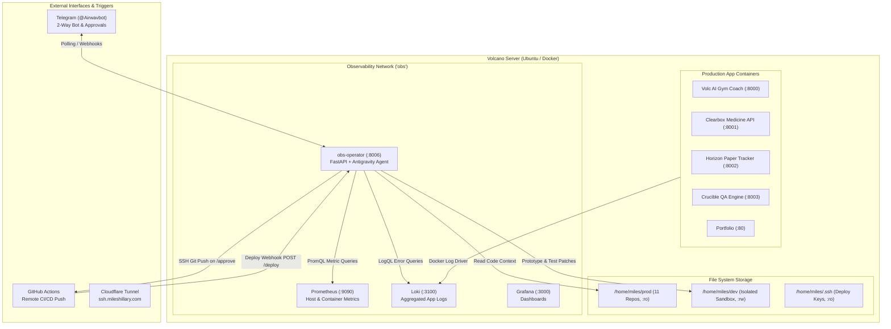

# Observer Architecture & Topology

> *Auto-generated on every push via GitHub Actions. Do not edit manually.*  
> **Last Generated:** 2026-09-22 10:26:25 UTC

Observer operates as the autonomous Site Reliability Engineering (SRE) and deployment orchestration engine for all applications running on the **Volcano** server.

---

## Core Security & Isolation Boundaries

1. **Strict Read-Only Production Code (`/codebases:ro`)**:
   * Live production directories in `/home/miles/prod` are mounted strictly read-only inside the operator container. The agent cannot modify live application code directly.
2. **Isolated Dev Sandbox (`/workspace/dev:rw`)**:
   * All bug investigation, prototyping, file editing, and test execution happen inside `/home/miles/dev/<project>`.
3. **Strict "No-Test, No-Push" Invariant**:
   * The operator agent cannot propose or apply a patch unless the automated test suite passes 100% in the dev sandbox.
4. **Approval-Gated Deployment**:
   * Patches are only committed and pushed to GitHub when explicitly approved by an authorized user via Telegram (`/approve <patch_id>`).

---

## Container Specifications

| Container Name | Service | Internal Port | Host Port | Memory Limit | Network |
| :--- | :--- | :--- | :--- | :--- | :--- |
| `obs-operator` | Operator FastAPI & Bot | `8000` | `127.0.0.1:8006` | `512 MB` | `observability` |
| `obs-prometheus`| Metrics Scraper & TSDB | `9090` | `127.0.0.1:9090` | `512 MB` | `observability` |
| `obs-loki` | Centralized Log Aggregator | `3100` | `127.0.0.1:3100` | `1024 MB`| `observability` |
| `obs-grafana` | Visualization UI | `3000` | `127.0.0.1:3000` | `256 MB` | `observability` |
